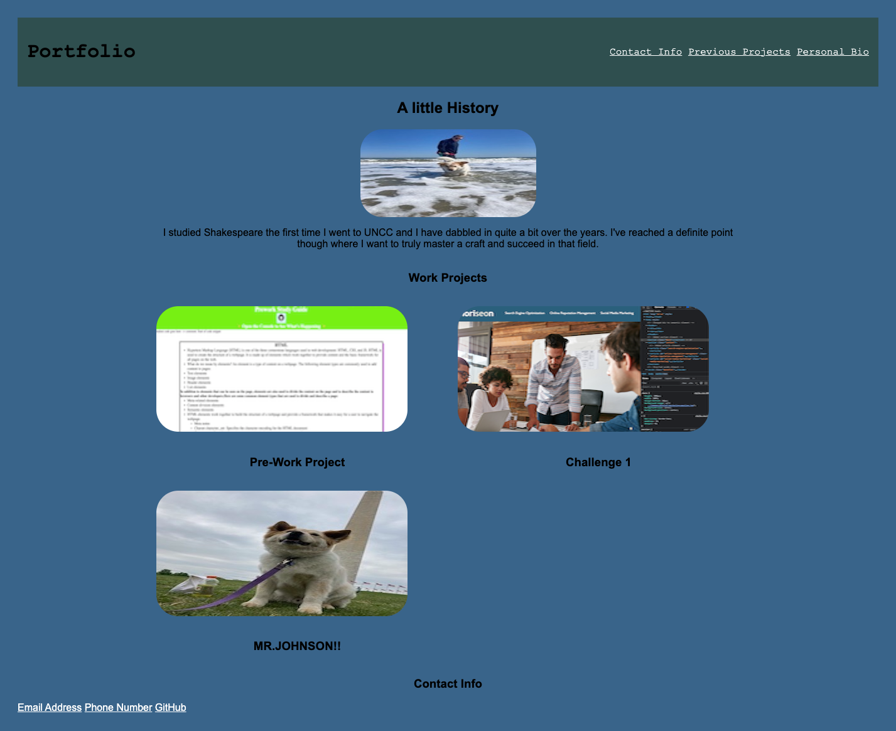

# portfolio-project
I am putting together the beginning of a portfolio as my first project assignment in bootcamp and will continue to modify it as my work grows.

## Acceptance Criteria
GIVEN I need to sample a potential employee's previous work
WHEN I load their portfolio
THEN I am presented with the developer's name, a recent photo or avatar, and links to sections about them, their work, and how to contact them
WHEN I click one of the links in the navigation
THEN the UI scrolls to the corresponding section
WHEN I click on the link to the section about their work
THEN the UI scrolls to a section with titled images of the developer's applications
WHEN I am presented with the developer's first application
THEN that application's image should be larger in size than the others
WHEN I click on the images of the applications
THEN I am taken to that deployed application
WHEN I resize the page or view the site on various screens and devices
THEN I am presented with a responsive layout that adapts to my viewport

## Assistance and credits
Anthony helped me touch up my css when I was struggling to clean it up.  My two friends Payne and Patty really stepped in and helped me figure some stuff out as well.

## No license
I don't know for sure but I don't think there's a license on here.  I may have put the MIT one as a default from pre-work stuff.\

## screenshot
